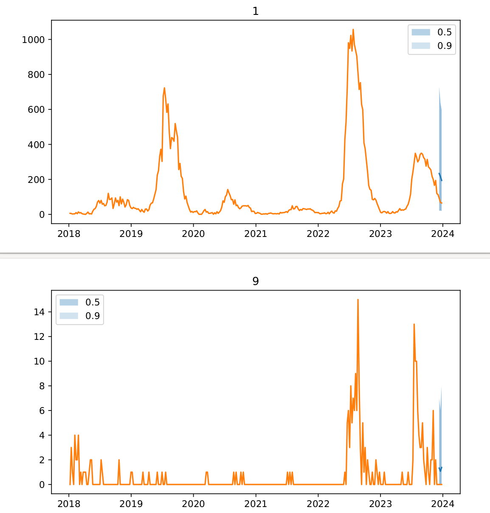

# Implementation of Ewars Plus with Chap

This is a small set of scripts for making the EWARS API that is available through docker (`maquins/ewars_plus_api:Upload`) compatible with the [Chap Modeling Platform](https://github.com/dhis2-chap/chap).

There have been no changes made to the model in order to make it compatible with Chap. Instead, the main purpose of this implementation is to convert the data formats used by Chap to formats compatible with the EWARS API and parse the predictions given by the API so that they are compatible with Chap. Additionally, a few 


## How to run the EWARS model with Chap

We have currently only verified that the model runs on some small "toy" example data from the Chap example data repository. The model is currently not available through the Modeling App (but may be added in the future). For now, the model can be run using the Chap command line interface.

### 1: Start the EWARS API docker image

Run the following to make sure the EWARS API is up an running:

```bash
docker run -it -dp 3288:3288 maquins/ewars_plus_api:Upload
```
### 2: Run evaluations using Chap

You will need to have weekly data compatible with Chap. The following is an example of how you can run with a csv file and a shapefile. Note that the shapefile is actually never used by the model, but is for some reason required. Chap validates that the shapefile is compatible with the data you provide.

```bash
chap evaluate /home/ivargry/dev/ewars_plus_python_wrapper/ --dataset-csv example_data/small_laos_data_with_polygons3.csv --polygons-json example_data/small_laos_data_with_polygons.geojson --n-splits 1 --debug --report-filename ewars_report.pdf --prediction-length 3 --ignore-environment --polygons-id-field district
```

After running the above command, you will get a small report with predictions in `report.pdf`. It should look something like this:



## Comparing the model to other model available through Chap

It is straight-forward to add more models to Chap. For example, one can run the Chap Ewars model on the same data by adding it to the `--model-name` argument like this:


## Inspecting the raw data used/created by the EWARS API
Since this is simply a wrapper around the EWARS API, it is possible to inspect the data used by and created by the API. A directory should be created when running `chap evaluate` where all the temporary data files are stored (see the output from chap evaluate to locate the directory, by default is should be in `runs/ewars_plus_python_wrapper/...`. By inspecting this directory, on can verify that the model behaves similarily when run with and without Chap as a middle-man.

# Caveats / potential issues

1) We have currently only tested the model on some small toy dataset. The model may easily break or not work on other data, and is likely to be very slow on bigger data sets.
2) An issue with the model is that it is not possible to ask for predictions for a given period. Instead, it will "shift" the start period based on the optimal lag it finds when training. This means that for any region, you may get predictions for different periods (somewhat arbitrarily). We have "hacked" around this by running the model twice: We first run it once to see what periods it gives, then we adjust the input data accordingly and run it again. This is hacky, but seems to works. Ideally, this issue should be fixed in the underlying model.

```bash
chap evaluate /home/ivargry/dev/ewars_plus_python_wrapper/ --dataset-csv example_data/small_laos_data_with_polygons2.csv --polygons-json example_data/small_laos_data_with_polygons.geojson --n-splits 1 --debug --report-filename ewars_report.pdf --prediction-length 3
```