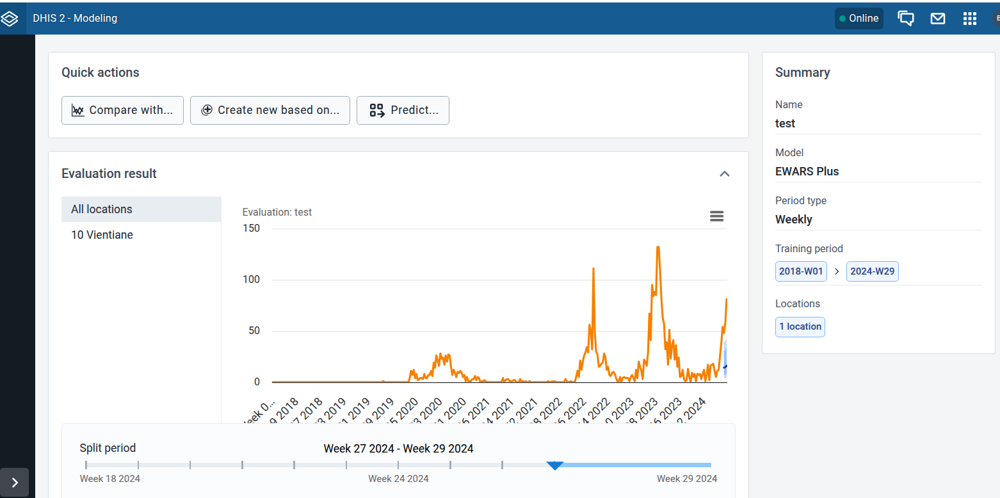

# Implementation of Ewars Plus with Chap

This is a small set of scripts for making the EWARS API that is available through docker (`maquins/ewars_plus_api:Upload`) compatible with the [Chap Modeling Platform](https://github.com/dhis2-chap/chap).

There have been no changes made to the model in order to make it compatible with Chap. Instead, the main purpose of this implementation is to convert the data formats used by Chap to formats compatible with the EWARS API and parse the predictions given by the API so that they are compatible with Chap. Additionally, a few tricks have been implemented to get the model to predict for correct time periods (see more details below). 


## How to run the EWARS model with Chap through the Modeling App

Add the EWARS API docker image to the chap compose.yml file:

```yaml
- url: https://github.com/dhis2-chap/ewars_plus_python_wrapper/
  versions:
    v1: "@modeling_app_test"
```

.. or you can alternative start the docker container manually before running Chap:
```bash
docker run -it -dp 3288:3288 maquins/ewars_plus_api:Upload
```

Then, make the model available in chap by adding this to `config/configured_models/default.yaml` in your chap installation:

```yaml
- url: https://github.com/dhis2-chap/ewars_plus_python_wrapper/
  versions:
    v1: "@modeling_app_test"
```


We have tested the model on our internal Laos test dataset, and successfully run it on data from 2018 to 2024 on the Vientiane province. Output should look something like this:



## How to run the EWARS model through chap on the command line with chap evaluate

Note: This branch is meant for the modeling app, and has some hardcoded urls in main.py. To run on the command line, change all occurrences of http://ewars_api:3288 to http://localhost:3288 in main.py.

### 1: Start the EWARS API docker image

Run the following to make sure the EWARS API is up an running:

```bash
docker run -it -dp 3288:3288 maquins/ewars_plus_api:Upload
```
### 2: Run evaluations using Chap

You will need to have weekly data compatible with Chap. The following is an example of how you can run with a csv file and a shapefile. Note that the shapefile is actually never used by the model, but is for some reason required. Chap validates that the shapefile is compatible with the data you provide.

```bash
chap evaluate https://github.com/dhis2-chap/ewars_plus_python_wrapper/ --dataset-csv example_data/small_laos_data_with_polygons3.csv --polygons-json example_data/small_laos_data_with_polygons.geojson --n-splits 1 --debug --report-filename ewars_report.pdf --prediction-length 3 --ignore-environment --polygons-id-field district
```

After running the above command, you will get a small report with predictions in `ewars_report.pdf`. It should look something like this:


## Comparing the model to other models available through Chap

It is straight-forward to add more models to Chap. For example, one can run the Chap Ewars Weekly model on the same data by adding it to the `--model-name` argument like this (note the two models separated by comma):

```bash
chap evaluate https://github.com/sandvelab/chap_auto_ewars_weekly@737446a7accf61725d4fe0ffee009a682e7457f6,https://github.com/dhis2-chap/ewars_plus_python_wrapper/ --dataset-csv example_data/small_laos_data_with_polygons3.csv --polygons-json example_data/small_laos_data_with_polygons.geojson --n-splits 1 --debug --report-filename ewars_report.pdf --prediction-length 3 --polygons-id-field district
```

The Chap cli does not give evaluation plots that show both models, but it gives csv output that provides various metrics for the two models:

```
Model,MSE,abs_error,abs_target_sum,abs_target_mean,seasonal_error,MASE,MAPE,sMAPE,MSIS,num_masked_target_values,QuantileLoss[0.1],Coverage[0.1],QuantileLoss[0.5],Coverage[0.5],QuantileLoss[0.9],Coverage[0.9],RMSE,NRMSE,ND,wQuantileLoss[0.1],wQuantileLoss[0.5],wQuantileLoss[0.9],mean_absolute_QuantileLoss,mean_wQuantileLoss,MAE_Coverage,OWA
https://github.com/sandvelab/chap_auto_ewars_weekly@737446a7accf61725d4fe0ffee009a682e7457f6,434.18338333333327,69.0,225.0,37.5,9.511802575107296,1.220566364244525,0.32108334972785096,1.2107850206432254,12.725451007060201,0.0,37.2,0.5,69.0,0.6666666666666666,50.999999999999986,1.0,20.837067532004912,0.5556551341867977,0.30666666666666664,0.16533333333333333,0.30666666666666664,0.2266666666666666,52.4,0.23288888888888884,0.5,
/home/ivargry/dev/ewars_plus_python_wrapper/,21138.786406037038,402.17400000000004,225.0,37.5,9.511802575107296,4.726652907012102,1.81073985179356,1.4717056653748861,21.98148237990192,0.0,31.010000000000005,0.5,402.17400000000004,1.0,323.47999999999996,1.0,145.39183748077826,3.877115666154087,1.7874400000000001,0.13782222222222223,1.7874400000000001,1.4376888888888888,252.22133333333332,1.1209837037037038,0.5,
```

## Inspecting the raw data used/created by the EWARS API
Since this is simply a wrapper around the EWARS API, it is possible to inspect the data used by and created by the API. A directory should be created when running `chap evaluate` where all the temporary data files are stored (see the output from chap evaluate to locate the directory, by default is should be in `runs/ewars_plus_python_wrapper/...`. By inspecting this directory, on can verify that the model behaves similarily when run with and without Chap as a middle-man.

# Caveats / potential issues

1) We have currently only tested the model on some small toy dataset. The model may easily break or not work on other data, and is likely to be very slow on bigger data sets.
2) An issue with the model is that it is not possible to ask for predictions for a given period. Instead, it will "shift" the start period based on the optimal lag it finds when training. This means that for any region, you may get predictions for different periods (somewhat arbitrarily). We have "hacked" around this by running the model twice: We first run it once to see what periods it gives, then we adjust the input data accordingly and run it again. This is hacky, but seems to works. Ideally, this issue should be fixed in the underlying model.
3) For now, this integration needs a manual start of the docker image, which means it cannot be automatically run through the Modeling App now. But this should be an easy fix in the future.
